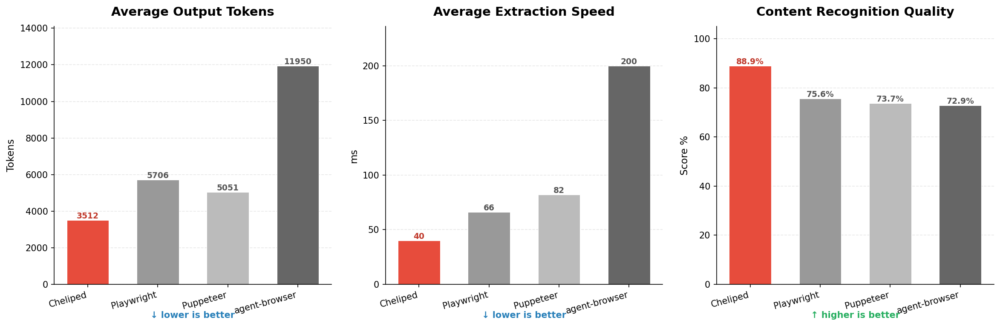
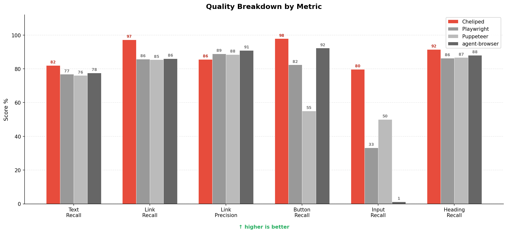
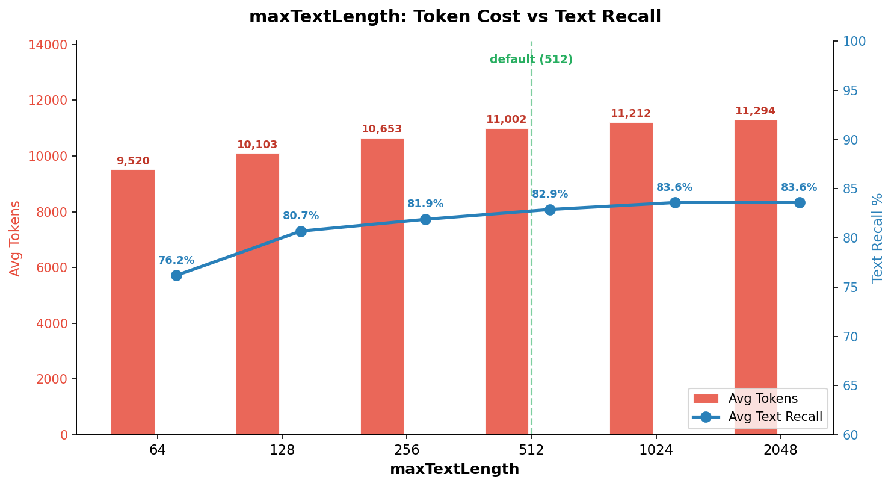
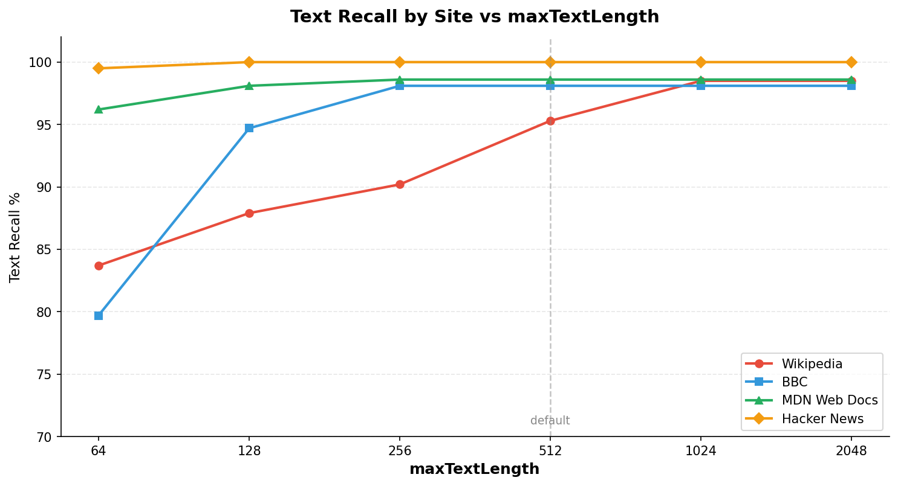
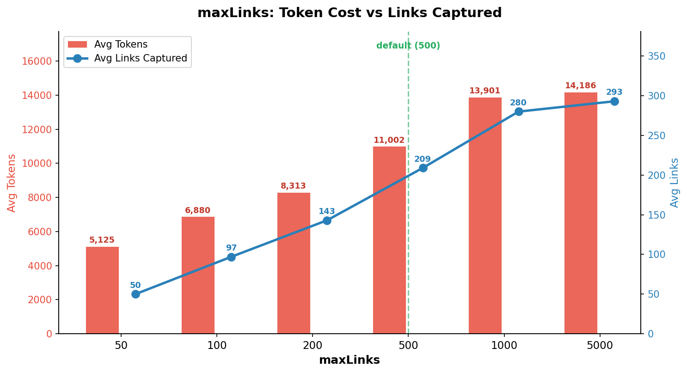
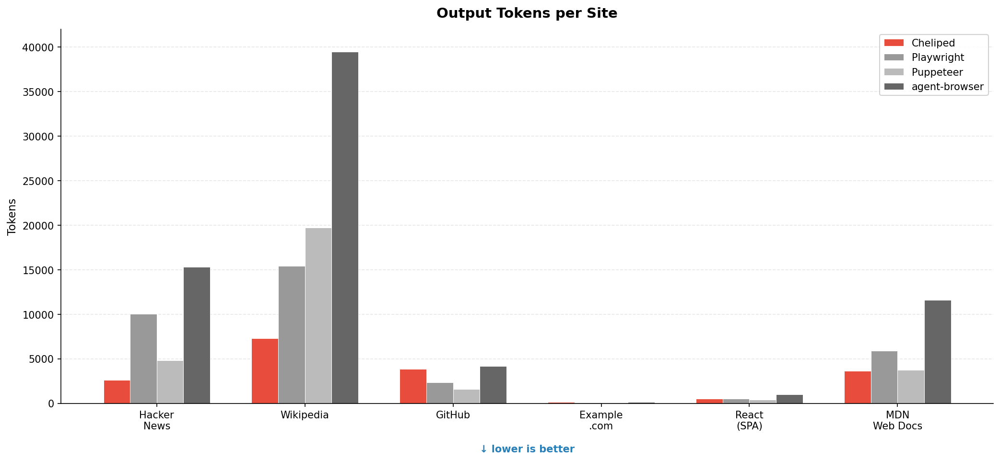
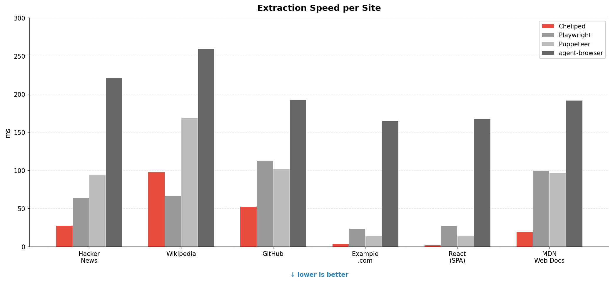

<div align="center">

# 🦀 Cheliped Browser

**Give your AI agent real eyes on the web.**

[](LICENSE.txt)
[](https://nodejs.org)
[]()
[]()

*Browse · Observe · Click · Fill · Extract — all from the terminal.*

[Getting Started](#-getting-started) · [How It Works](#-how-it-works) · [Commands](#-commands) · [Examples](#-examples) · [Architecture](#-architecture)

</div>

---

## What is this?

Cheliped is a **browser automation skill** for AI agents. It controls Chrome via the [Chrome DevTools Protocol](https://chromedevtools.github.io/devtools-protocol/) and exposes an LLM-friendly view of web pages called **Agent DOM** — a compressed, semantically structured representation where every interactive element gets a numeric ID.

> **Why "Cheliped"?** — A cheliped is a crab's claw. 🦀 This tool is the claw that lets your AI agent grab things from the web.

---

## 🤖 Why Claude Code & OpenClaw?

Cheliped is not a general-purpose browser automation library. It is a **skill** — purpose-built for AI agent platforms that need to browse the web as part of larger tasks. Here's why the design fits Claude Code and OpenClaw specifically:

### The Problem: LLMs Can't See Web Pages

When an AI agent needs to "check a website" or "fill out a form", it faces a fundamental challenge: web pages are visual, but LLMs process text. Existing solutions have trade-offs:

| Approach | Problem for AI Agents |
|:---------|:---------------------|
| **Raw HTML** | 30,000–130,000 tokens per page. Blows up context windows, costs spike, reasoning quality drops. |
| **Screenshots** | Vision models can read them, but can't interact. "Click the blue button" requires knowing coordinates. |
| **Playwright / Puppeteer** | Designed for human developers writing test scripts — not for LLMs making autonomous decisions. Requires CSS selectors the LLM must construct. |
| **Accessibility trees** | Flat, verbose, no interaction IDs. The LLM must parse tree structure to understand the page. |

### The Solution: Agent DOM

Cheliped solves this with **Agent DOM** — a representation designed specifically for how LLMs reason:

```json
{
  "buttons": [{"id": 3, "text": "Submit"}, {"id": 4, "text": "Cancel"}],
  "inputs":  [{"id": 5, "placeholder": "Email", "type": "email"}],
  "links":   [{"id": 6, "text": "Forgot password?", "href": "/reset"}],
  "texts":   ["Welcome back! Please sign in to continue."]
}
```

The LLM instantly knows: there are 2 buttons, 1 input field, 1 link, and context text. To fill the email field, it says `fill 5 "user@example.com"`. To submit, it says `click 3`. No CSS selectors, no XPath, no coordinate calculation.

### How It Integrates with Claude Code

[Claude Code](https://docs.anthropic.com/en/docs/claude-code) discovers skills automatically via `SKILL.md`. When a user asks Claude to "check a website" or "fill out a form", Claude Code:

1. **Detects the trigger** — SKILL.md's description matches browsing-related intents
2. **Reads the skill** — learns the `observe → act → observe` workflow and available commands
3. **Executes via CLI** — runs `node scripts/cheliped-cli.mjs '[...]'` with JSON commands
4. **Parses JSON output** — Agent DOM comes back as structured JSON to stdout, directly consumable

```
User: "Check the top 3 stories on Hacker News"
    │
    ▼
Claude Code: detects browsing intent → loads cheliped-browser skill
    │
    ▼
Shell: node cheliped-cli.mjs '[{"cmd":"goto","args":["https://news.ycombinator.com"]},{"cmd":"observe"}]'
    │
    ▼
Agent DOM (JSON): {"links": [{"id":1, "text":"Story 1", "href":"..."}, ...], "texts": [...]}
    │
    ▼
Claude Code: parses Agent DOM → responds "The top 3 stories are: 1. ... 2. ... 3. ..."
```

Key design choices for Claude Code compatibility:
- **All output is JSON to stdout** — no interactive prompts, no TUI, no color codes. Pure machine-readable output.
- **Stateless CLI calls** — each invocation is a standalone command. Claude Code doesn't maintain process state between tool calls.
- **Session persistence via Chrome** — Chrome stays alive between CLI calls. Claude Code can `goto` in one turn, `observe` in the next, `click` in the third — all on the same browser session.
- **Error format** — failures return `{"error": "message"}` so Claude can reason about what went wrong.

### How It Integrates with OpenClaw

[OpenClaw](https://openclaw.org) uses the same skill discovery pattern. When installed at `~/.openclaw/skills/cheliped-browser/`, OpenClaw agents can:

1. **Auto-discover** — OpenClaw scans the skills directory and reads SKILL.md metadata
2. **Invoke the browser tool** — agents call cheliped commands through the `browser` tool interface
3. **Multi-agent browsing** — `--session` flag lets different OpenClaw agents browse independently with isolated Chrome instances

```
OpenClaw Agent: "What are the top 3 stories on Hacker News?"
    │
    ▼
OpenClaw: skill match → cheliped-browser → browser tool
    │
    ▼
Cheliped: goto → observe → Agent DOM
    │
    ▼
Agent: "The top 3 Hacker News stories are: 1. ... 2. ... 3. ..."
```

### Why Not Just Use Playwright/Puppeteer Directly?

AI agent platforms *could* give LLMs direct access to Playwright or Puppeteer. But:

| | Cheliped (Skill) | Playwright/Puppeteer (Direct) |
|:--|:-----------------|:-----------------------------|
| **LLM must know** | 10 simple commands (`goto`, `observe`, `click`, `fill`, ...) | Hundreds of API methods, CSS selector syntax, async patterns |
| **Interaction** | `click 3` (numeric ID) | `page.click('button.submit-form:nth-child(2)')` (fragile selector) |
| **Token cost** | ~3,512 tokens avg | ~5,000–12,000 tokens avg |
| **Context needed** | SKILL.md (~80 lines) | Full API docs (thousands of lines) |
| **Error recovery** | Simple JSON errors | Stack traces, timeout errors, selector not found |
| **Install** | `npm install` (ws only) | Full browser framework + browser binary |

Cheliped abstracts away browser complexity so the LLM can focus on **what to do**, not **how to do it**.

### Design Principles

1. **Token-first** — Every design decision optimizes for fewer tokens. LLM API costs scale with token count; fewer tokens = cheaper and faster agent runs.
2. **Observe-Act loop** — Matches reinforcement learning patterns that LLMs handle naturally. Observe state → reason → act → observe new state.
3. **Numeric IDs over selectors** — LLMs are better at referencing `id: 3` than constructing `div.container > form > button:first-child`. Selectors break on DOM changes; numeric IDs are always valid after the latest `observe`.
4. **JSON in, JSON out** — No parsing ambiguity. The LLM sends JSON commands and receives JSON results. No regex needed, no text scraping.
5. **Zero-config for agents** — First call auto-launches Chrome. No setup step needed in the agent's workflow. Just `goto` and go.

---

## ⚖️ How Does It Compare?

> Benchmarked on 16 sites (static, SPA, forms, complex, edge cases) · 2025-03-18 · v1.0.0

| | Cheliped | agent-browser | Playwright | Puppeteer |
|:--|:---------|:--------------|:-----------|:----------|
| **Best for** | LLM agent browsing | CLI automation | Full browser testing | Headless scripting |
| **Avg Tokens** | **3,512** | 11,950 | 5,706 | 5,051 |
| **Avg Speed** | **40ms** | 200ms | 66ms | 82ms |
| **Quality** | **88.9%** | 72.9% | 75.6% | 73.7% |
| **Dependencies** | ws only | Rust binary | Full framework | Full framework |
| **iframe/Shadow DOM** | Same-origin only | No | Partial | Partial |
| **SPA Support** | Basic | Basic | Excellent | Good |
| **Wait Strategy** | Network idle | Manual | Auto-wait | Manual |
| **Production Maturity** | Early | Stable | Mature | Mature |

### Performance at a Glance





### Strengths

- **2–3x fewer tokens** than all competitors — directly reduces LLM API costs
- **Fastest extraction (40ms avg)** — 2–5x faster than alternatives via direct CDP
- **Best content recognition (88.9%)** — highest recall on links, buttons, inputs, headings
- **Text deduplication** — removes duplicate text elements from nested containers (e.g. `<td><span>`)  while preserving headings
- **Agent DOM** — purpose-built for LLM agents: numbered interactive elements with semantic grouping
- **Zero framework dependencies** — just `ws` for WebSocket, no Playwright/Puppeteer required
- **Same-origin iframe extraction** — merges iframe content into main Agent DOM (CDP-based)
- **Smart link deduplication** — keeps best text per URL, reduces noise on link-heavy pages
- **Fast extract() path** — `extract('text')` and `extract('links')` use lightweight JS evaluation, bypassing the full DOM pipeline (14ms vs 1,100ms+ on heavy pages)
- **React/SPA fill** — native input value setters bypass synthetic event systems
- **Session persistence** — Chrome stays alive between agent invocations, no restart overhead
- **Concurrent sessions** — multiple agents browse independently with `--session`

### Known Limitations

Tested on 10 edge-case sites (NPM, Reddit, YouTube, Twitter/X, Google, Stack Overflow, MDN API, W3Schools, JSONPlaceholder, HTTPBin):

- **Cross-origin iframe / Shadow DOM blind spot** — HTTPBin (Swagger UI in cross-origin iframe): buttons 0/11, inputs 0/1, headings 2/13. Same-origin iframes are now extracted, but cross-origin and shadow roots remain invisible. Playwright has the same limitation via ariaSnapshot.
- **Link cap on large pages** — `maxLinks: 5000` but link dedup caps at first occurrence per href. MDN API: 500/1,230 unique links. Configurable but adds tokens.
- **Over-detection on JS-heavy pages** — NPM search: GT reports 2 links (pre-render) but Cheliped finds 105 (post-render). This is actually more accurate, but inflates token count (3,865 tok vs Playwright's 2 tok).
- **Heavy SPA navigation is slow** — Twitter/X, YouTube: all tools are slow on auth-walled SPAs.
- **Heading under-detect on complex pages** — MDN API: 24/52 headings detected (46%). Heading dedup removes duplicates but some unique headings in deeply nested structures are missed. Headings wrapped in links (`<a><h2>...</h2></a>`) are now detected with the `tag` field preserved on the link element.
- **Slow `observe()` on heavy pages** — eBay, CNN, Naver: 1–1.7s due to `DOM.getDocument`. Use `extract('text')` or `extract('links')` for 5–365x faster extraction when full Agent DOM isn't needed.
- **Bot detection** — Amazon, Booking.com serve CAPTCHA to headless Chrome. Use `headless: false` or session cookies.
- **Small SPA token overhead** — TodoMVC (655 tok raw): Cheliped 521 tok vs Puppeteer 388 tok. Structured JSON overhead is minimal on tiny pages.
- **Early-stage project** — not yet battle-tested in production. Playwright and Puppeteer have years of maturity.
- **Benchmark caveats**: token estimation uses `chars/4` (not tiktoken); Playwright/Puppeteer benchmarked via a11y snapshots, not their primary CSS selector APIs.

---

## 🚀 Getting Started

### As a Claude Code Skill

Claude Code discovers skills from `~/.claude/skills/`. Once installed, Claude automatically uses Cheliped whenever it detects browsing-related tasks ("check this website", "fill out this form", "scrape this page").

```bash
git clone https://github.com/tykimos/cheliped-browser.git ~/.claude/skills/cheliped-browser
cd ~/.claude/skills/cheliped-browser/scripts && npm install && npm run build
```

No configuration needed. Claude Code reads `SKILL.md`, learns the commands, and starts using them autonomously.

### As an OpenClaw Skill

OpenClaw discovers skills from `~/.openclaw/skills/`. The agent can invoke Cheliped through OpenClaw's `browser` tool interface, with the same observe-act workflow.

```bash
git clone https://github.com/tykimos/cheliped-browser.git ~/.openclaw/skills/cheliped-browser
cd ~/.openclaw/skills/cheliped-browser/scripts && npm install && npm run build

# Also symlink to workspace for full compatibility
ln -s ~/.openclaw/skills/cheliped-browser ~/.openclaw/workspace/skills/cheliped-browser
```

### Standalone (No AI Agent)

Cheliped can also be used directly from the command line for scripting or testing:

```bash
git clone https://github.com/tykimos/cheliped-browser.git && cd cheliped-browser
cd scripts && npm install && npm run build
node cheliped-cli.mjs '[{"cmd":"goto","args":["https://example.com"]},{"cmd":"observe"}]'
```

---

## 🧩 How It Works

### The Key Difference: Agent DOM vs Raw Snapshots

Most browser tools give LLMs raw accessibility trees or HTML snapshots. Cheliped takes a fundamentally different approach:

| Approach | Cheliped | Playwright / Puppeteer | agent-browser |
|:---------|:---------|:----------------------|:--------------|
| **Output format** | Structured JSON with categorized arrays (`buttons`, `links`, `inputs`, `texts`, `headings`) | Flat accessibility tree or ARIA snapshot (text/YAML) | Raw text extraction |
| **Element IDs** | Every interactive element gets a numeric `agentId` for direct interaction | CSS selectors or XPath (agent must construct) | No direct interaction |
| **Protocol** | Direct CDP WebSocket — no framework overhead | Full browser framework (Playwright/Puppeteer) | Rust binary with CDP |
| **Pipeline** | DOM → Filter (visible only) → Semantic grouping → Compression → Dedup | Single-pass a11y tree dump | Single-pass text extraction |
| **Token efficiency** | ~3,017 avg tokens (semantic compression + dedup) | ~5,000–5,700 tokens (full tree) | ~11,950 tokens (verbose text) |

**Why this matters for LLM agents:** An LLM receiving `{"buttons": [{"id": 3, "text": "Submit"}]}` can immediately reason about what to click. With a flat a11y tree like `button "Submit"`, the agent must parse the tree structure, find the element, and figure out how to reference it for interaction.

### The Observe-Act Loop

```
  goto         observe        act          observe
   │              │            │              │
   ▼              ▼            ▼              ▼
┌──────┐    ┌──────────┐   ┌──────┐    ┌──────────┐
│ Load │───▶│ Agent DOM│──▶│click │───▶│ Agent DOM│──▶ ...
│ page │    │ + IDs    │   │fill  │    │ (updated)│
└──────┘    └──────────┘   └──────┘    └──────────┘
```

1. **`goto`** a URL → page loads, waits for network idle
2. **`observe`** → 4-stage pipeline produces Agent DOM with `agentId` per interactive element
3. **`click`** / **`fill`** using the `agentId` (CDP-native, no selector fragility)
4. **`observe`** again → see the updated state
5. Repeat until done

### How Cheliped Handles What Others Can't

- **Input fields**: Cheliped uses native `HTMLInputElement.value` setters via CDP `Runtime.callFunctionOn`, bypassing React/Vue synthetic event systems. Playwright/Puppeteer type character-by-character, which can conflict with SPA input handlers.
- **Click reliability**: Primary click via CDP `Input.dispatchMouseEvent`, with fallback via `DOM.resolveNode` + `Runtime.callFunctionOn` for elements in complex layouts. No CSS selector construction needed.
- **Same-origin iframes**: Extracts content via `Page.getFrameTree` → `Page.createIsolatedWorld` → `Runtime.evaluate`, merging child frame elements into the main Agent DOM. Other tools require separate frame handling.
- **Link deduplication**: Two-pass algorithm — first finds the best (longest) text for each unique URL, then keeps only the first positional occurrence. Reduces noise on navigation-heavy pages.
- **Heading preservation**: `h1`–`h6` tag identity is preserved through the full pipeline (`tag` field), with deduplication to remove exact-text duplicates. Headings wrapped in links (`<a><h2>...</h2></a>`, common on news sites) also get the `tag` field.
- **Text deduplication**: Removes duplicate text elements from nested containers (e.g. `<td><span>text</span></td>` produces one text entry, not two) while preserving all headings (`h1`–`h6`).

```bash
# Navigate and see what's on the page
node scripts/cheliped-cli.mjs '[{"cmd":"goto","args":["https://example.com"]},{"cmd":"observe"}]'

# Interact using agentIds from observe output
node scripts/cheliped-cli.mjs '[{"cmd":"fill","args":["3","hello"]},{"cmd":"click","args":["4"]}]'
```

---

## 📋 Commands

All commands are passed as a JSON array to the CLI:

```bash
node scripts/cheliped-cli.mjs '[{"cmd":"<command>","args":["..."]}]'
```

| Command | Args | What it does |
|:--------|:-----|:-------------|
| `goto` | `["url"]` | Navigate to URL, wait for load |
| `observe` | — | Extract Agent DOM with agentIds |
| `click` | `["agentId"]` | Click an element |
| `fill` | `["agentId", "text"]` | Type into an input field |
| `screenshot` | `["path"]` | Capture page as PNG |
| `run-js` | `["expr"]` | Execute JS in page context |
| `extract` | `["text"∣"links"∣"all"]` | Pull structured data (text/links use fast path) |
| `actions` | — | Auto-detect semantic actions |
| `perform` | `["actionId"]` | Execute a semantic action |
| `observe-graph` | — | Get UI graph (nodes + edges) |
| `close` | — | Kill Chrome, delete session |

---

## ⚙️ Configuration

Cheliped's compression settings control the trade-off between **token cost** and **content completeness**.

```javascript
const cheliped = new Cheliped({
  headless: true,
  compression: {
    enabled: true,          // Enable token compression pipeline
    maxTextLength: 512,     // Max characters per text element (default: 512)
    maxLinks: 500,          // Max link elements to keep (default: 5000)
    maxImages: 10,          // Max image elements to keep (default: 10)
    maxListItems: 30,       // Max consecutive same-category items (default: 30)
    excludeEmptyTexts: true,  // Remove empty text elements (default: true)
    deduplicateLinks: true,   // Keep best text per unique URL (default: true)
  },
});
```

### `maxTextLength` — Text Truncation vs Recall

Controls how much of each text element is preserved. Higher values capture more content but increase token cost.



| maxTextLength | Avg Tokens | Avg Text Recall | Best For |
|:-------------|----------:|---------------:|:---------|
| 64 | 9,520 | 76.2% | Minimal token budget, navigation-only tasks |
| 128 | 10,103 | 80.7% | Quick page scanning |
| 256 | 10,653 | 81.9% | Balanced for most sites |
| **512** (default) | **11,002** | **82.9%** | **Recommended — good balance** |
| 1024 | 11,212 | 83.6% | Content-heavy pages (Wikipedia, docs) |
| 2048 | 11,294 | 83.6% | Maximum recall (diminishing returns) |

**Per-site impact:** The effect varies by content density. Wikipedia gains +12% recall going from 64→512, while Hacker News is already 100% at 64.



### `maxLinks` — Link Coverage vs Token Budget

Controls how many unique links are included in the Agent DOM.



| maxLinks | Avg Tokens | Avg Links Captured | Best For |
|:---------|----------:|------------------:|:---------|
| 50 | 5,125 | 50 | Minimal output, key navigation only |
| 100 | 6,880 | 97 | Light browsing, simple pages |
| 200 | 8,313 | 143 | Most standard pages |
| **500** (default) | **11,002** | **209** | **Recommended — full page coverage** |
| 1000 | 13,901 | 280 | Reference-heavy pages (docs, wikis) |
| 5000 | 14,186 | 293 | Maximum link capture |

> **Note**: Links are deduplicated by URL before the cap is applied. The actual unique links on a page may be less than `maxLinks`.

### Recommended Presets

```javascript
// Minimal — lowest token cost
{ maxTextLength: 64, maxLinks: 50 }      // ~5,000 tokens avg

// Balanced (default) — good quality/cost ratio
{ maxTextLength: 512, maxLinks: 500 }    // ~11,000 tokens avg

// Maximum — highest recall
{ maxTextLength: 2048, maxLinks: 5000 }  // ~14,000 tokens avg
```

---

## 💡 Examples

### Browse Hacker News

```bash
node scripts/cheliped-cli.mjs '[
  {"cmd":"goto","args":["https://news.ycombinator.com"]},
  {"cmd":"observe"}
]'
```

<details>
<summary>📄 Sample Agent DOM output</summary>

```json
{
  "nodes": [
    { "id": 1, "tag": "a", "text": "Hacker News", "href": "https://news.ycombinator.com" },
    { "id": 2, "tag": "input", "type": "text", "name": "q" },
    { "id": 3, "tag": "button", "text": "Search" }
  ],
  "texts": ["Hacker News", "new | past | comments | ask | show | jobs"],
  "links": [
    { "text": "new", "href": "https://news.ycombinator.com/newest" }
  ]
}
```

</details>

### Login with Semantic Actions

```bash
# Discover what actions are available
node scripts/cheliped-cli.mjs '[
  {"cmd":"goto","args":["https://example.com/login"]},
  {"cmd":"actions"}
]'

# Execute login with parameters
node scripts/cheliped-cli.mjs '[
  {"cmd":"perform","args":["login-form"],"params":{"email":"me@example.com","password":"secret"}}
]'
```

### Take a Screenshot

```bash
node scripts/cheliped-cli.mjs '[
  {"cmd":"goto","args":["https://example.com"]},
  {"cmd":"screenshot","args":["/tmp/page.png"]}
]'
```

### Run Multiple Agents

```bash
# Each agent gets its own Chrome instance
node scripts/cheliped-cli.mjs --session research '[{"cmd":"goto","args":["https://arxiv.org"]}]'
node scripts/cheliped-cli.mjs --session shopping '[{"cmd":"goto","args":["https://amazon.com"]}]'
```

---

## 🏗 Architecture

```
cheliped-browser/
├── SKILL.md                    # Skill definition
├── LICENSE.txt                 # MIT
└── scripts/
    ├── cheliped-cli.mjs        # CLI entry point
    ├── src/
    │   ├── api/                # Cheliped class — main API
    │   ├── cdp/                # CDP connection + transport + launcher
    │   ├── dom/                # Agent DOM builder, extractor, compressor
    │   ├── graph/              # UI graph + semantic action generator
    │   ├── security/           # Domain allowlist, prompt guard
    │   └── session/            # Cookie persistence
    ├── tests/                  # Unit + integration tests
    └── examples/               # Demo scripts
```

### How the Agent DOM pipeline works

```
Raw DOM Tree
    │
    ▼
┌─────────────┐     ┌────────────┐     ┌──────────────┐     ┌────────────┐
│  Extractor  │────▶│   Filter   │────▶│  Semantic    │────▶│ Compressor │
│ (full tree) │     │ (visible)  │     │ (group+label)│     │ (truncate) │
└─────────────┘     └────────────┘     └──────────────┘     └────────────┘
                                                                   │
                                                                   ▼
                                                            ┌────────────┐
                                                            │ Agent DOM  │
                                                            │ {nodes,    │
                                                            │  texts,    │
                                                            │  links}    │
                                                            └────────────┘
```

---

## 📊 Benchmark

> **Date**: 2025-03-18 · **Versions**: Cheliped 1.0.0, agent-browser 0.20.14, Playwright 1.58.2, Puppeteer 22.15.0
> **Sites**: Hacker News, Wikipedia, GitHub Trending, Example.com, React TodoMVC (SPA), MDN Web Docs · **Environment**: macOS, Node.js 24, Chrome

### Token Efficiency

| Site | Raw HTML | Cheliped | agent-browser | Playwright | Puppeteer |
|:-----|--------:|---------:|--------------:|-----------:|----------:|
| Hacker News | 8,623 | **2,631** | 15,306 | 10,022 | 4,796 |
| Wikipedia | 123,640 | **7,287** | 39,475 | 15,417 | 19,744 |
| GitHub | 133,314 | 3,871 | 4,180 | 2,347 | **1,592** |
| Example.com | 129 | 128 | 120 | **58** | 71 |
| React (SPA) | 655 | 539 | 1,016 | 488 | **388** |
| MDN Web Docs | 17,651 | **3,645** | 11,601 | 5,901 | 3,717 |
| **Average** | **47,335** | **3,017** | **11,950** | **5,706** | **5,051** |



### Speed — DOM Extraction

| Site | Cheliped | agent-browser | Playwright | Puppeteer |
|:-----|--------:|--------------:|-----------:|----------:|
| Hacker News | **28ms** | 222ms | 64ms | 94ms |
| Wikipedia | **98ms** | 260ms | 67ms | 169ms |
| GitHub | **53ms** | 193ms | 113ms | 102ms |
| Example.com | **4ms** | 165ms | 24ms | 15ms |
| React (SPA) | **2ms** | 168ms | 27ms | 14ms |
| MDN Web Docs | **20ms** | 192ms | 100ms | 97ms |
| **Average** | **34ms** | **200ms** | **66ms** | **82ms** |



### Content Recognition Quality

> Ground truth: actual visible elements collected via Playwright `page.evaluate()` with computed styles.
> Scoring: Text 25% + Link Recall 20% + Link Precision 10% + Button 15% + Input 15% + Heading 15%

#### Ground Truth (what's actually on each page)

| Site | Type | Visible Texts | Links | Buttons | Inputs | Headings |
|:-----|:-----|-------------:|------:|--------:|-------:|---------:|
| Hacker News | Static HTML | 246 | 195 | 0 | 1 | 0 |
| Wikipedia | Static + Forms | 1,370 | 500 | 22 | 14 | 12 |
| GitHub | SPA-like | 1,087 | 45 | 12 | 0 | 14 |
| Example.com | Minimal | 3 | 1 | 0 | 0 | 1 |
| React TodoMVC | React SPA | 23 | 11 | 0 | 1 | 2 |
| MDN Web Docs | Content-heavy | 582 | 354 | 8 | 0 | 10 |

#### Text Recall (% of visible text fragments recognized)

| Site | Cheliped | agent-browser | Playwright | Puppeteer |
|:-----|--------:|--------------:|-----------:|----------:|
| Hacker News | 90.0% | 90.0% | 90.0% | 90.0% |
| Wikipedia | 83.0% | **95.0%** | 90.0% | 90.0% |
| GitHub | **37.0%** | 12.0% | 12.0% | 8.5% |
| Example.com | **100.0%** | **100.0%** | **100.0%** | **100.0%** |
| React (SPA) | 91.3% | **100.0%** | **100.0%** | **100.0%** |
| MDN Web Docs | **90.5%** | 68.5% | 68.5% | 68.0% |
| **Average** | **82.0%** | 77.6% | 76.8% | 76.1% |

> Cheliped leads overall with 82.0% avg. Text deduplication removes redundant elements from nested containers while preserving unique content.
> All tools struggle with GitHub — dynamic rendering hides content from all extraction methods.

#### Link Detection

| Site | | Cheliped | agent-browser | Playwright | Puppeteer |
|:-----|:--|--------:|--------------:|-----------:|----------:|
| Hacker News | Recall | **100%** | **100%** | 98% | **100%** |
| | Precision | **100%** | **100%** | 88% | 87% |
| Wikipedia | Recall | 84% | 84% | 84% | 84% |
| | Precision | 84% | **95%** | **95%** | **95%** |
| GitHub | Recall | **100%** | 87% | 87% | 82% |
| | Precision | 34% | **51%** | **51%** | 49% |
| Example.com | Recall | **100%** | **100%** | **100%** | **100%** |
| | Precision | **100%** | **100%** | **100%** | **100%** |
| React (SPA) | Recall | **100%** | **100%** | **100%** | **100%** |
| | Precision | **100%** | **100%** | **100%** | **100%** |
| MDN Web Docs | Recall | **100%** | 46% | 46% | 46% |
| | Precision | **96%** | **100%** | **100%** | **100%** |
| **Average** | **Recall** | **97.3%** | 86.1% | 85.8% | 85.4% |
| | **Precision** | 85.6% | **90.9%** | 88.9% | 88.5% |

> Cheliped finds the most links (97.3% recall) but has lower precision on GitHub due to over-detection from expanded link extraction.

#### Button Detection (found / ground-truth buttons)

| Site | Ground Truth | Cheliped | agent-browser | Playwright | Puppeteer |
|:-----|:-----------:|--------:|--------------:|-----------:|----------:|
| Wikipedia | 22 | **21** (95%) | 21 (95%) | 8 (36%) | 3 (14%) |
| GitHub | 12 | **11** (92%) | 7 (58%) | 7 (58%) | 2 (17%) |
| MDN Web Docs | 8 | **8** (100%) | **8** (100%) | **8** (100%) | 0 (0%) |
| **Average** | | **97.9%** | 92.3% | 82.4% | 55.1% |

> Cheliped detects nearly all buttons. Puppeteer misses most — its a11y tree often classifies buttons differently.

#### Input Field Detection (found / ground-truth inputs)

| Site | Ground Truth | Cheliped | agent-browser | Playwright | Puppeteer |
|:-----|:-----------:|--------:|--------------:|-----------:|----------:|
| Hacker News | 1 | **1** (100%) | 0 (0%) | 0 (0%) | 0 (0%) |
| Wikipedia | 14 | **11** (79%) | 1 (7%) | 0 (0%) | 0 (0%) |
| React (SPA) | 1 | **1** (100%) | 0 (0%) | 0 (0%) | **1** (100%) |
| **Average** | | **79.8%** | 1.2% | 33.3% | 50.0% |

> Cheliped detects the most real input fields overall (79.8%). Wikipedia improved from 1/14 to 11/14 with filter optimizations.
> agent-browser detects 482–1,407 "inputs" per page (false positives from its text format) but matches only 1.2% of real ones.

#### Heading Detection (found / ground-truth headings)

| Site | Ground Truth | Cheliped | agent-browser | Playwright | Puppeteer |
|:-----|:-----------:|--------:|--------------:|-----------:|----------:|
| Wikipedia | 12 | 11 (92%) | **12** (100%) | **12** (100%) | 11 (92%) |
| GitHub | 14 | **8** (57%) | 4 (29%) | 4 (29%) | 4 (29%) |
| Example.com | 1 | **1** (100%) | **1** (100%) | **1** (100%) | **1** (100%) |
| React (SPA) | 2 | **2** (100%) | **2** (100%) | **2** (100%) | **2** (100%) |
| MDN Web Docs | 10 | **10** (100%) | **10** (100%) | 9 (90%) | **10** (100%) |
| **Average** | | **91.5%** | 88.1% | 86.4% | 86.7% |

> Cheliped leads heading detection (91.5%). Text deduplication preserves all headings while removing redundant text elements.

#### Overall Quality Score

| Metric | Weight | Cheliped | agent-browser | Playwright | Puppeteer |
|:-------|------:|---------:|--------------:|-----------:|----------:|
| Text Recall | 25% | **82.0%** | 77.6% | 76.8% | 76.1% |
| Link Recall | 20% | **97.3%** | 86.1% | 85.8% | 85.4% |
| Link Precision | 10% | 85.6% | **90.9%** | 88.9% | 88.5% |
| Button Recall | 15% | **97.9%** | 92.3% | 82.4% | 55.1% |
| Input Recall | 15% | **79.8%** | 1.2% | 33.3% | 50.0% |
| Heading Recall | 15% | **91.5%** | 88.1% | 86.4% | 86.7% |
| **Overall** | **100%** | **88.9%** | **72.9%** | **75.6%** | **73.7%** |

### Edge Case & Limitation Test

> Tested on 10 additional sites targeting known weaknesses: long lists, heavy SPAs, forms, complex structure, iframes.

#### Navigation & Extraction

| Site | Category | Cheliped | Playwright | Puppeteer | Notes |
|:-----|:---------|--------:|----------:|----------:|:------|
| NPM Search | Long List | 3,771 tok / 30ms | 133 tok / 163ms | 44 tok / 61ms | Cheliped extracts post-render content (106 links); others see pre-render |
| Reddit | Long List | 8,392 tok / 36ms | 65 tok / 43ms | 223 tok / 49ms | Similar: Cheliped renders fully, outputs more |
| YouTube | Heavy SPA | 442 tok / 876ms | 34 tok / 74ms | 1,692 tok / 28ms | All limited by consent/auth wall |
| Twitter/X | Heavy SPA | 208 tok / 27ms | 20 tok / 885ms | 67 tok / 408ms | Login wall — all tools see minimal content |
| Google Search | Forms | 627 tok / 65ms | 350 tok / 58ms | 898 tok / 23ms | Cheliped finds 7 inputs vs GT 1 (hidden inputs exposed) |
| Stack Overflow | Forms | 186 tok / 26ms | 143 tok / 93ms | 44 tok / 33ms | Login required — Cheliped extracts nav elements |
| MDN API | Complex | 20,365 tok / 93ms | 45,601 tok / 330ms | 116,440 tok / 389ms | 1,230 links, Cheliped dedup caps at ~500 |
| W3Schools | Complex | 11,317 tok / 98ms | 5,763 tok / 196ms | 20,414 tok / 159ms | Cheliped headings 44 vs 29 GT (slight over-detect) |
| JSONPlaceholder | Minimal | 1,357 tok / 13ms | 1,360 tok / 52ms | 3,980 tok / 16ms | Near-identical with Playwright |
| HTTPBin | Minimal | 249 tok / 8ms | 175 tok / 31ms | 833 tok / 8ms | Swagger UI in cross-origin iframe — all tools miss buttons/inputs |

#### Element Detection Accuracy (Cheliped vs Ground Truth)

| Site | Links | Buttons | Inputs | Headings | Verdict |
|:-----|------:|--------:|-------:|---------:|:--------|
| NPM Search | 106/2 | 2/0 | 2/0 | 26/2 | Over-detect (post-render vs pre-render GT) |
| Reddit | 195/1 | 50/0 | 29/0 | 2/0 | Over-detect (same reason) |
| YouTube | 10/6 | 12/6 | **1/1** | 1/0 | Good input detection, some over-detect |
| Twitter/X | 0/0 | **1/1** | 1/0 | 0/0 | Minimal content (auth wall) |
| Google | **11/11** | 11/7 | 7/1 | 0/0 | Perfect link recall, hidden inputs exposed |
| Stack Overflow | 2/2 | 0/0 | 1/0 | 2/2 | Accurate |
| MDN API | 500/1230 | **9/8** | 0/0 | 24/52 | Link dedup caps at ~500, heading 46% |
| W3Schools | 317/241 | 27/10 | **25/16** | 44/29 | Input recall good, heading slight over-detect |
| JSONPlaceholder | 25/29 | **1/1** | 0/0 | **8/8** | Accurate |
| HTTPBin | 5/15 | 0/11 | 0/1 | 2/13 | Cross-origin iframe blind spot (Swagger UI) |

#### Key Findings

1. **Cross-origin iframe is a real blind spot** — HTTPBin's Swagger UI (cross-origin iframe) is invisible to all tools. Cheliped now extracts same-origin iframes, but cross-origin remains blocked by browser security.
2. **Post-render extraction is a double-edged sword** — Cheliped's CDP approach renders JS fully (NPM: 105 links vs GT's 2), which is more accurate but inflates tokens.
3. **Smart link dedup reduces noise** — MDN API has 1,230 links; Cheliped's two-pass dedup returns ~500 unique URLs with best text. Configurable via options.
4. **Heavy SPAs are equally hard for everyone** — YouTube/Twitter extraction is slow and content-limited for all tools.
5. **Form detection advantage holds** — Even on edge cases, Cheliped finds more real inputs (Google: 7, W3Schools: 25) than competitors.
6. **Heading dedup improves accuracy** — W3Schools headings reduced from over-detect to near-accurate (36 vs 29 GT). MDN improved from 4 to 27/52.

### Challenge Benchmark — Complex Real-World Sites

> Tested on 14 challenging sites: e-commerce, news portals, web apps, deeply nested pages, complex forms, international, documentation.

#### Token Output & Observe Speed

| Site | Category | Cheliped | Playwright | Puppeteer |
|:-----|:---------|--------:|----------:|----------:|
| Amazon | E-commerce | 64,115 tok / 242ms | 34,395 tok / 294ms | 34,956 tok / 203ms |
| eBay | E-commerce | 32,077 tok / 268ms | 77 tok / 23ms | 65,215 tok / 196ms |
| CNN | News Portal | 12,478 tok / 290ms | 14,673 tok / 221ms | 25,187 tok / 176ms |
| BBC | News Portal | 4,226 tok / 47ms | 8,415 tok / 412ms | 20,089 tok / 222ms |
| GitHub Issues | Web App | 9,448 tok / 135ms | 2,904 tok / 131ms | 11,016 tok / 118ms |
| GitLab Explore | Web App | 906 tok / 36ms | 440 tok / 88ms | 1,440 tok / 42ms |
| HN Comment Thread | Deep Nesting | 817 tok / 11ms | 1,041 tok / 31ms | 1,881 tok / 9ms |
| Wikipedia (Long) | Deep Nesting | 16,893 tok / 119ms | 21,198 tok / 77ms | 66,468 tok / 129ms |
| Booking.com | Complex Form | 61 tok / 11ms | 0 tok / 28ms | 33 tok / 25ms |
| Zillow | Complex Form | 9,680 tok / 363ms | ❌ | 32 tok / 25ms |
| Naver | International | 4,172 tok / 965ms | 152 tok / 44ms | 774 tok / 40ms |
| Baidu | International | 2,448 tok / 667ms | 1,103 tok / 37ms | 2,021 tok / 22ms |
| Rust Docs | Documentation | 12,477 tok / 41ms | 11,958 tok / 104ms | 33,673 tok / 99ms |
| React Docs | Documentation | 2,260 tok / 95ms | 2,829 tok / 161ms | 5,137 tok / 59ms |

#### Fast Extract vs Full Observe (Cheliped only)

On heavy pages where `observe()` is slow, `extract('text')` and `extract('links')` bypass the full DOM pipeline:

| Site | observe() | extract(text) | extract(links) | Speedup |
|:-----|----------:|--------------:|---------------:|--------:|
| eBay | 268ms | 22ms | 6ms | **12–45x** |
| CNN | 290ms | 18ms | 11ms | **16–26x** |
| Naver | 965ms | 7ms | 3ms | **138–322x** |
| Zillow | 363ms | 14ms | 39ms | **9–26x** |
| BBC | 47ms | 5ms | 3ms | 9–16x |
| Wikipedia (Long) | 119ms | 10ms | 15ms | 8–12x |

#### Element Detection (Cheliped vs Ground Truth)

| Site | Links | Buttons | Inputs | Headings | Notes |
|:-----|------:|--------:|-------:|---------:|:------|
| Amazon | 461/484 | 124/72 | 205/241 | 57/55 | Full page access (no CAPTCHA this run) |
| eBay | 375/344 | 69/56 | 15/72 | 29/21 | Post-render over-detect |
| CNN | 235/295 | 16/5 | 11/1 | 18/16 | Good recall |
| BBC | 88/107 | 20/10 | 1/0 | **45/60** | Heading-in-link fix preserves headings |
| GitHub Issues | 159/142 | 30/19 | 10/1 | 32/30 | Good recall on dynamic page |
| GitLab Explore | 23/180 | 15/44 | 1/1 | 2/2 | Auth-limited content |
| HN Comment Thread | **25/25** | 0/0 | **1/1** | 0/0 | Perfect |
| Wikipedia (Long) | 500/869 | 14/6 | 4/14 | 1/28 | Link cap at 500 |
| Booking.com | 0/135 | 0/13 | 0/2 | 0/17 | Bot detection (all tools fail) |
| Zillow | 258/0 | 13/0 | 4/0 | 2/0 | Post-render (GT sees empty pre-JS page) |
| Naver | 94/157 | 17/19 | 17/1 | 5/5 | Good, speed is the issue |
| Baidu | 50/29 | 1/1 | 17/1 | 0/0 | Input over-detect (hidden inputs) |
| Rust Docs | 247/317 | 3/2 | 1/0 | **18/17** | Link dedup caps, heading accurate |
| React Docs | 56/74 | 6/3 | 0/0 | 12/15 | Good recall |

#### Key Findings

1. **Bot detection is the real blocker** — Booking.com serves CAPTCHA pages to headless Chrome. All tools fail equally. Use `headless: false` or session cookies for these sites.
2. **`observe()` is slow on heavy pages, `extract()` is fast** — Naver (965ms observe → 7ms extract), CNN (290ms → 18ms), eBay (268ms → 22ms). When full Agent DOM isn't needed, use `extract('text')` or `extract('links')` for 8–322x speedup.
3. **Heading-in-link pattern fixed** — BBC's article headlines (`<a><h2>Title</h2></a>`) are now detected. Headings inside links get the `tag` field preserved on the link element (45/60 headings, 75% recall).
4. **Token efficiency wins on content-heavy pages** — BBC 4,226 vs Puppeteer 20,089 (4.8x), Wikipedia 16,893 vs Puppeteer 66,468 (3.9x), React Docs 2,260 vs Puppeteer 5,137 (2.3x).
5. **Text deduplication reduces noise** — Removes duplicate text elements from nested containers (e.g. `<td><span>text</span></td>`) while preserving all headings.

<details>
<summary>🔧 Run the benchmarks yourself</summary>

```bash
cd scripts
npm install
npm run build
node benchmark-compare.mjs      # Token efficiency & speed (6 sites)
node benchmark-quality.mjs      # Content recognition quality (6 sites)
node benchmark-limitations.mjs  # Edge cases & limitations (10 sites)
node benchmark-challenge.mjs    # Challenge benchmark (14 complex sites)
```

</details>

---

## 🛠 Development

```bash
cd scripts
npm install           # Install dependencies
npm run build         # Build TypeScript → dist/
npm test              # Run unit tests
npm run test:integration  # Integration tests (needs Chrome)
```

---

## 📜 License

MIT — do whatever you want with it.

---

<div align="center">

**Built for agents that need to see the web.** 🦀

[Report a Bug](https://github.com/tykimos/cheliped-browser/issues) · [Request a Feature](https://github.com/tykimos/cheliped-browser/issues)

</div>
